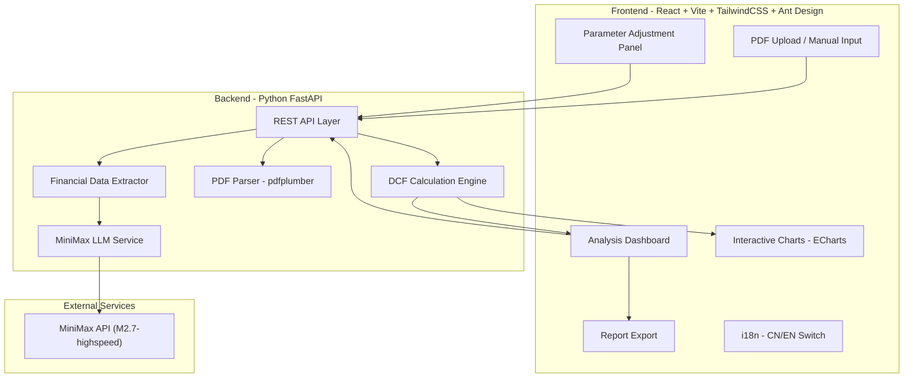
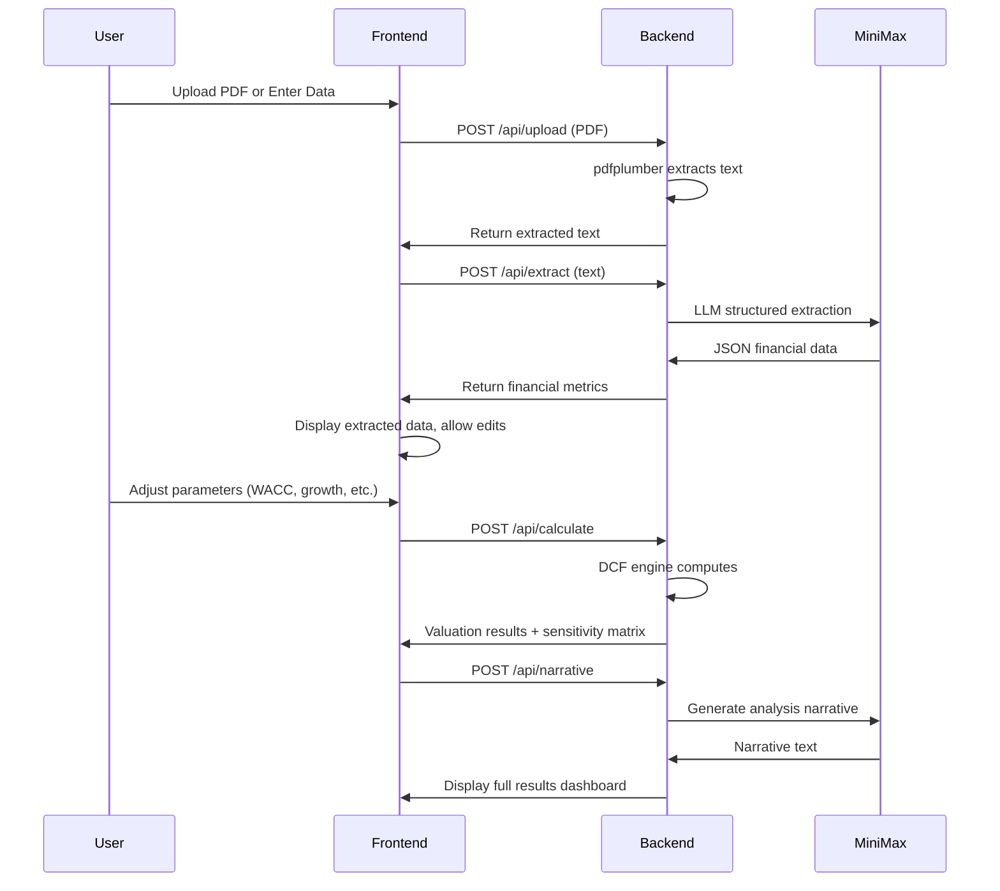

# DCF Valuation Analysis Intelligent Agent

## Architecture Overview




## Tech Stack

- **Backend**: Python 3.11+, FastAPI, Uvicorn, Pydantic, pdfplumber, OpenAI SDK (MiniMax compatible)
- **Frontend**: React 18, TypeScript, Vite, TailwindCSS, Ant Design 5, ECharts (echarts-for-react), react-i18next, Zustand
- **LLM**: MiniMax-M2.7-highspeed via OpenAI-compatible endpoint (`https://api.minimaxi.com/v1`)

## Project Structure

```
dcfestimate/
├── backend/
│   ├── main.py                  # FastAPI entry point + CORS
│   ├── requirements.txt
│   ├── config.py                # Environment config (API keys, etc.)
│   ├── api/
│   │   ├── upload.py            # PDF upload endpoints
│   │   ├── analysis.py          # DCF analysis endpoints
│   │   └── report.py            # Report generation endpoints
│   ├── services/
│   │   ├── llm_service.py       # MiniMax LLM wrapper
│   │   ├── pdf_service.py       # PDF text extraction
│   │   ├── extractor_service.py # LLM-based financial data extraction
│   │   └── dcf_service.py       # DCF calculation engine
│   └── models/
│       └── schemas.py           # Pydantic request/response models
├── frontend/
│   ├── package.json
│   ├── vite.config.ts
│   ├── tailwind.config.js
│   ├── src/
│   │   ├── App.tsx
│   │   ├── main.tsx
│   │   ├── i18n/
│   │   │   ├── index.ts         # i18n setup
│   │   │   ├── zh.json          # Chinese translations
│   │   │   └── en.json          # English translations
│   │   ├── pages/
│   │   │   ├── HomePage.tsx     # Landing / entry page
│   │   │   ├── AnalysisPage.tsx # Main analysis workspace
│   │   │   └── ResultPage.tsx   # Results & report page
│   │   ├── components/
│   │   │   ├── FileUpload.tsx   # PDF upload component
│   │   │   ├── ManualInput.tsx  # Manual financial data form
│   │   │   ├── ParamPanel.tsx   # WACC/growth rate parameter panel
│   │   │   ├── DCFResult.tsx    # Valuation result display
│   │   │   ├── CashFlowChart.tsx      # FCF projection chart
│   │   │   ├── SensitivityTable.tsx   # Sensitivity analysis heatmap
│   │   │   ├── WaterfallChart.tsx     # Valuation waterfall
│   │   │   └── LanguageSwitch.tsx     # CN/EN toggle
│   │   ├── services/
│   │   │   └── api.ts           # Axios API client
│   │   ├── store/
│   │   │   └── useStore.ts      # Zustand global state
│   │   └── types/
│   │       └── index.ts         # TypeScript type definitions
│   └── public/
└── README.md
```

## Core Feature Design

### 1. Financial Data Input (Two Modes)

**PDF Upload Mode:**

- User uploads PDF financial report
- `pdfplumber` extracts text content
- Text is sent to MiniMax LLM with structured prompt
- LLM returns JSON with extracted financial metrics

**Manual Input Mode:**

- Ant Design form with fields for: Revenue (3-5 years), EBITDA, CapEx, D&A, Working Capital Changes, Tax Rate, Net Debt, Cash, Shares Outstanding, Beta, etc.
- Pre-filled with defaults where appropriate

### 2. MiniMax LLM Integration

Use the OpenAI-compatible SDK:

```python
from openai import OpenAI

client = OpenAI(
    api_key="YOUR_MINIMAX_API_KEY",
    base_url="https://api.minimaxi.com/v1"
)

response = client.chat.completions.create(
    model="MiniMax-M2.7-highspeed",
    messages=[
        {"role": "system", "content": FINANCIAL_EXTRACTION_PROMPT},
        {"role": "user", "content": pdf_text}
    ],
    response_format={"type": "json_object"}
)
```

The LLM will be used for:

- Extracting structured financial data from unstructured PDF text
- Suggesting reasonable growth rate assumptions based on industry analysis
- Generating narrative analysis of the valuation results

### 3. DCF Calculation Engine

Core formulas implemented in `dcf_service.py`:

- **FCFF** = EBIT x (1 - Tax Rate) + Depreciation & Amortization - CapEx - Change in Working Capital
- **WACC** = (E/(E+D)) x Re + (D/(E+D)) x Rd x (1-T), where Re = Rf + Beta x (Rm - Rf) via CAPM
- **Terminal Value** = FCF_n x (1+g) / (WACC - g) (Gordon Growth Model)
- **Enterprise Value** = Sum of PV(FCF_t) + PV(Terminal Value)
- **Equity Value per Share** = (Enterprise Value - Net Debt + Cash) / Shares Outstanding
- **Sensitivity Analysis**: Matrix of equity value across different WACC and terminal growth rate combinations

### 4. Frontend UI Design

The UI follows a **step-by-step wizard flow** with three main pages:

- **Home Page**: Hero section with project description, "Start Analysis" CTA button
- **Analysis Page**: Left panel for data input (tabs: Upload / Manual), right panel for real-time parameter adjustment (WACC components, growth rates, forecast period)
- **Result Page**: Full dashboard with:
  - Valuation summary card (Enterprise Value, Equity Value, Price per Share)
  - FCF projection bar chart (historical + forecasted)
  - Sensitivity analysis heatmap (WACC vs Terminal Growth Rate)
  - Valuation waterfall chart (from revenue to equity value per share)
  - LLM narrative analysis section
  - Export to PDF button

Color theme: Professional finance blue/dark with accent colors. Support dark/light mode toggle along with CN/EN language switch.

### 5. API Endpoints

- `POST /api/upload` - Upload PDF, return extracted text
- `POST /api/extract` - Send text to LLM, return structured financial data
- `POST /api/calculate` - Run DCF model with given parameters, return full results
- `POST /api/sensitivity` - Run sensitivity analysis matrix
- `POST /api/narrative` - Generate LLM narrative analysis of results
- `GET /api/health` - Health check

### 6. Key Data Flow




## Implementation Order

Tasks are ordered by dependency -- backend core first, then frontend, then integration and polish.